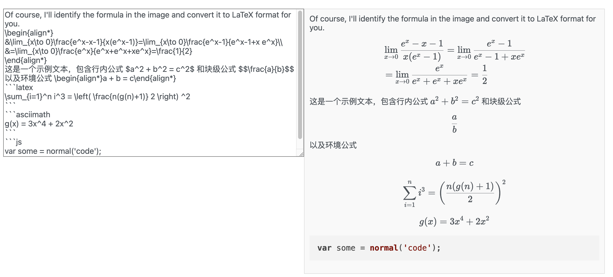

# evaluation

## Project setup
```
npm install
```

### Compiles and hot-reloads for development
```
npm run serve
```

### Compiles and minifies for production
```
npm run build
```

### Lints and fixes files
```
npm run lint
```

### Customize configuration
See [Configuration Reference](https://cli.vuejs.org/config/).

# 前端文档结构
- router
存放各页面信息的路由
- component
各个组件和页面
  - BasePage
    选择dataset model standard的初始页面 + ImageModel
  - HomePage
    选择dataset model standard的初始页面
  - ImageModel
    显示模型和QA信息，以及打分情况。包含高级筛选：Tag筛选、Category筛选、最低分筛选、最高分筛选、两个模型时分更高和更低筛选
  - EvaHeader
    系统右上角的综合功能按钮。
    包含： 
      - 回到主界面（BasePage）
      - 上传文件：上传dataset，result，score。后两个可以批量上传
      - 删除相关信息： 删除dataset，删除result（包含分数一起删掉了）
      - 查看打分结果：选择一个dataset和多个模型结果，下载一个zip文件，里面是每个模型的打分情况
      - 查看dataset信息：下载dataset_info.json文件
      - 准确率表格：计算每个模型结果在不同 category和tag下的准确率，包含导出Excel功能
      - 修改模型名称
      - Markdown编译：包含用于模型answer显示的customed markdown编译器。下面的用于检查公式是否是正确格式
  - MarkdownEditor 
    evaheader里的Markdown 编译内容
  - LoadingComponent
    加载框
  - AccuracyTable
    准确率表格
  - ImageVoice
    ImageModel第一版本+音频+多图+多轮对话
- store
  vuex的数据通信
- utils - api.js
  连接后端的接口文件

# Markdown + Latex渲染
目前支持的公式格式
1. 
```latex
\sum_{i=1}^n i^3 = \left( \frac{n(g(n)+1)} 2 \right) ^2
``` 
2.
```asciimath
g(x) = 3x^4 + 2x^2
``` 
3. `行内公式 $a^2 + b^2 = c^2$ `
4. `块级公式 $$\frac{a}{b}$$`
5. `环境公式 \begin{align*}a + b = c\end{align*}`
   囊括的环境有：['align', 'align*', 'equation', 'equation*', 'flalign','flalign*','gather', 'gather*', 'multline', 'multline*','subequations','subequations*','split','split*','gathered','gathered*','aligned','aligned*','alignedat','alignedat*']

